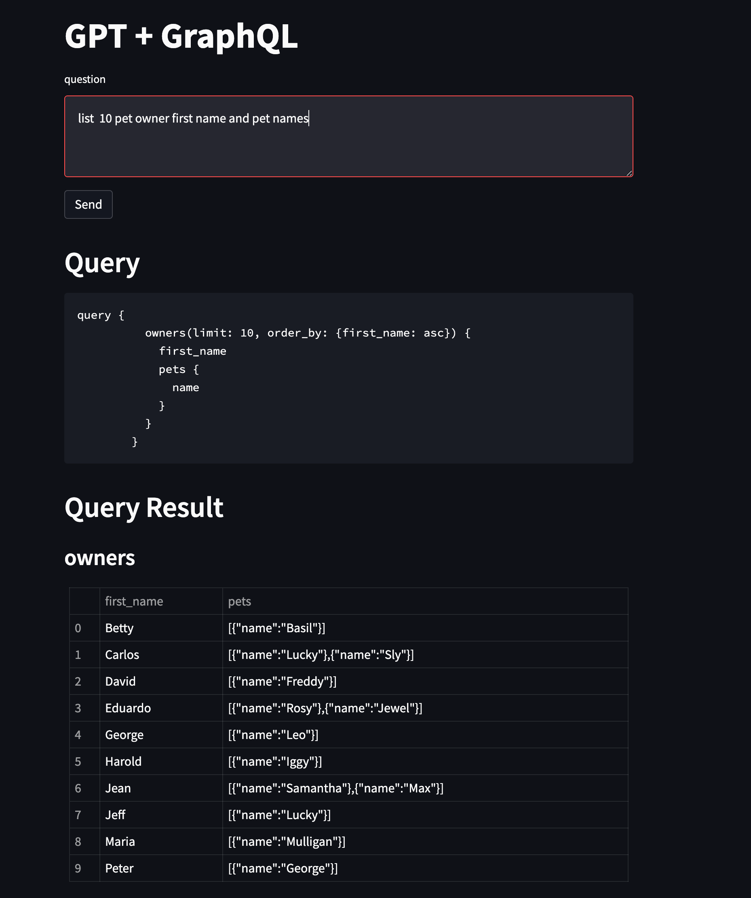

# OpenAI GPT + Hasura GraphQL Engine

This demo repository showcases how to use OpenAI and LangChain to convert natural language queries into GraphQL queries and then query Hasura.



## Prerequisites

- Docker and docker-compose
- Hasura CLI
- OpenAI API key

## Getting Started

1. Clone this repository
2. Start the Hasura server by running the following command:

    ```bash
    docker-compose up -d
    ```

3. Deploy the Hasura metadata and migrations using the Hasura CLI:

    ```bash
    hasura deploy --with-seeds
    ```

4. Set up your OpenAI API key by exporting it as an environment variable:

    ```bash
    export OPENAI_API_KEY=<your-openai-api-key>
    ```

5. Start the application by running the following command:

    ```bash
    streamlit run app.py
    ```

6. Navigate to the URL provided by Streamlit to use the application.

## Using a different Hasura GraphQL schema

you may want to use a custom schema that you have defined yourself. Here are the steps to do so:

1. Replace the `schema.json` file with your custom schema with following `appolo-codegen` command:

    ```bash
    npm install -g apollo
    apollo schema:download --endpoint http://localhost:8080/v1/graphql
    ```

2. Restart the Streamlit application.


## References

- [Hasura GraphQL Engine](https://hasura.io)
- [spring-petclinic](https://github.com/spring-projects/spring-petclinic/blob/main/src/main/resources/db/postgres/schema.sql): The database schema and seeds used in this demo
